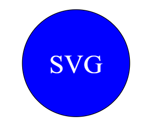
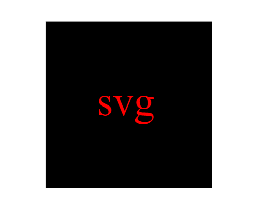
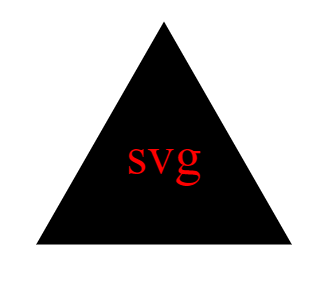

# SVG-Logo-Maker


Walk-through Video: https://watch.screencastify.com/v/2ItG4wutdQAd0E2RiLT8

## Description

This application, powered by Node.js, operates via the command line and empowers users to create logos by inputting their preferences. It guides users through selecting colors, shapes, and text for the logo, ultimately saving the customized design as an SVG file.

## Table of Contents

* [Installation](#Installation)

* [Usage](#usage)

* [License](#license)

* [Contributing](#contributing)

* [Tests](#tests)

* [Questions](#questions)


## Installation

To install dependencies, run these commands:

```
npm install
```


## Usage

- User can generate circle svg logo with this application.



- User can generate square svg logo with this application.




- User can generate triangle svg logo with this application.




## License

      Copyright © MIT. All rights reserved. 
      
      Licensed under the MIT license.


## Contributing
To make this project better, please fork the repo and create a pull request. You can also simply open an issue with the tag "enhancement".

* Fork the Project
* Create your Feature Branch (git checkout -b feature/AmazingFeature)
* Commit your Changes (git commit -m 'Add some AmazingFeature')
* Push to the Branch (git push origin feature/AmazingFeature)
* Open a Pull Request


## Tests

To run tests, run these commands:

```
npm run test
```

## Questions
This project is contributed by [yul402](https://github.com/yul402/)

Contact infotmation: Ying.li20@outlook.com
